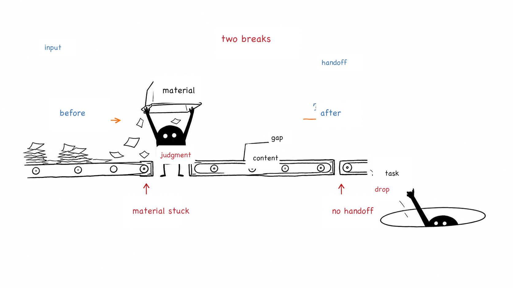
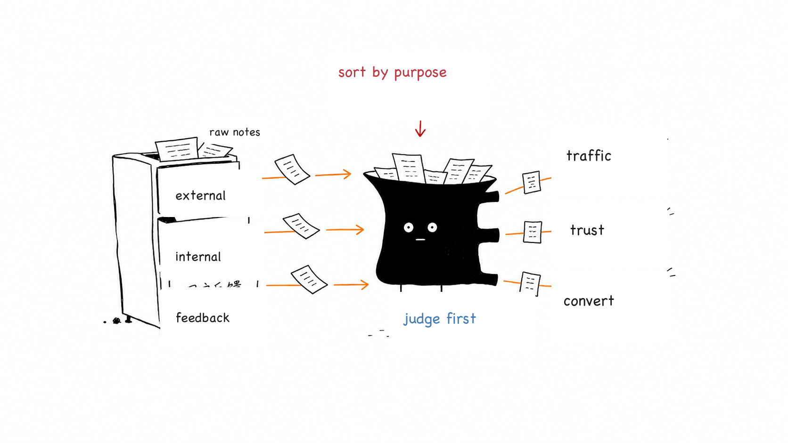
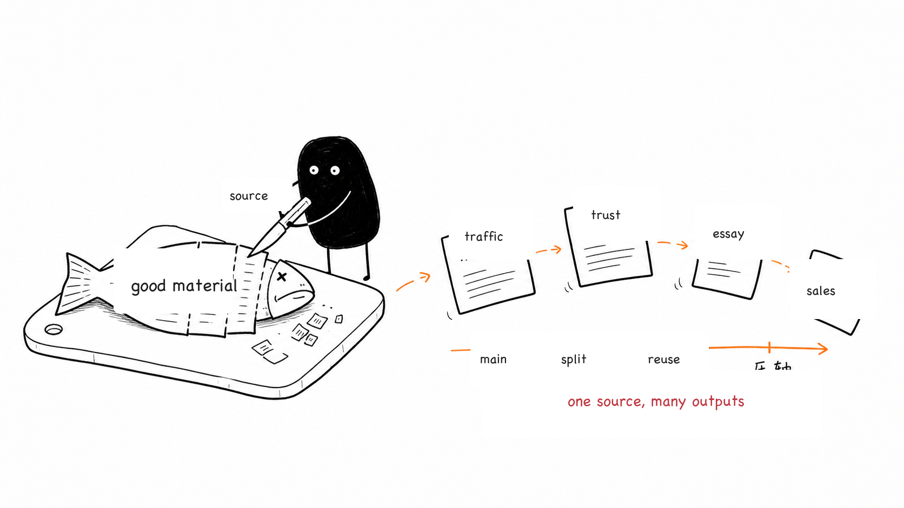
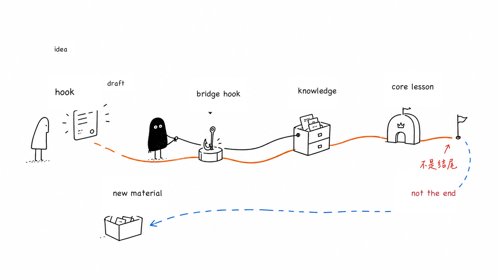
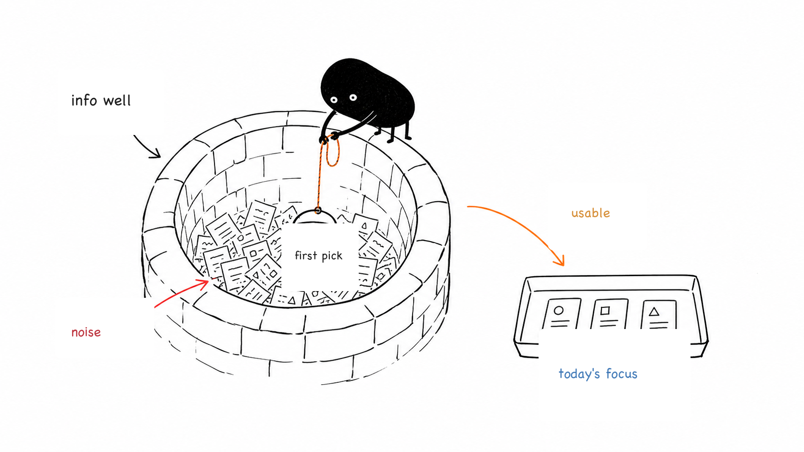
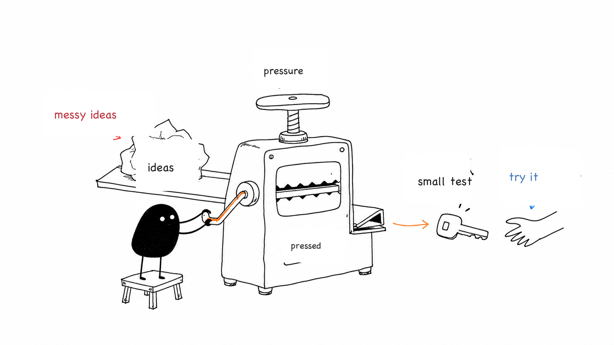
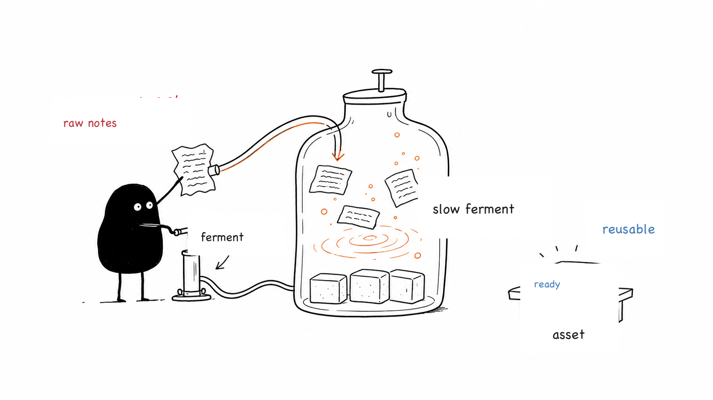
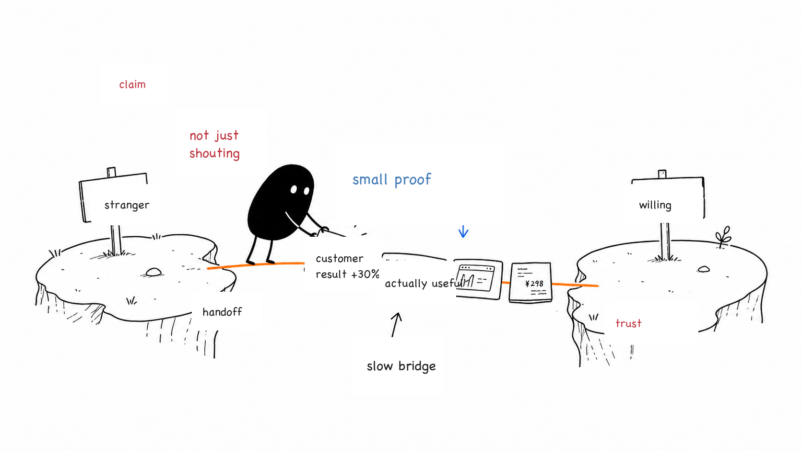

# Ian Xiaohei Illustrations

> Turn judgments, workflows, states, and metaphors in English articles into clean, strange, hand-drawn body illustrations on a white background.
>
> 16:9 landscape | Xiaohei character | pure white hand-drawn style | sparse red/orange/blue English notes | Codex Skill

---

## What This Repository Is

Ian Xiaohei Illustrations is a Codex Skill that guides an AI agent to create body illustrations for English articles, posts, blogs, Notion documents, and methodology content.

It is not a generic illustration prompt or a PPT infographic template. Its goal is to understand the article's cognitive anchors first, then turn one judgment, workflow, structure, state, or metaphor into a memorable 16:9 hand-drawn explanation sketch.

The default visual character is `Xiaohei`: a small solid-black figure with white dot eyes, thin legs, and a blank expression. Xiaohei is not a mascot, sticker, or corner decoration. Xiaohei is a deadpan worker seriously participating in the system.

In one sentence: **make AI draw the key cognitive action inside the article, not just "add an image."**

---

## Who It Is For

Useful for:

- People writing English articles who need body illustrations.
- People creating knowledge content, methodology content, or AI workflow content.
- People who want to turn abstract judgments into concrete metaphors.
- People who want an illustration style that is lighter, stranger, and more personally recognizable than PPT infographics.
- People using Codex for content production who want a reusable visual language.

Not useful for:

- Commercial illustrations, brand key visuals, or polished flat illustrations.
- Traditional PPT infographics, complex architecture diagrams, or formal flowcharts.
- Children's cartoons, cute mascot IP, or sticker-style images.
- Packing long explanations, full lessons, or dense prose into one image.
- Strictly editable vector source files.

---

## What It Produces

Default output:

- 16:9 landscape body illustrations.
- A 4-8 image shot list for one article.
- Theme, core idea, structure type, Xiaohei action, and suggested English labels for each image.
- Final PNG images saved to `assets/<article-slug>-illustrations/` in the workspace.

Default non-output:

- PPTX / PDF / Keynote.
- Editable SVG / HTML / Canvas diagrams.
- Commercial posters or cover key visuals.
- Text-heavy infographics.

---

## Visual Style

This skill uses Ian's strange Xiaohei article-illustration style:

- Pure white background, with no paper texture, beige tone, shadow, or gradient.
- Black hand-drawn line art, thin lines, and slight wobble.
- Generous whitespace, with the subject using about 40%-60% of the frame.
- A few short red, orange, and blue handwritten English notes.
- One image expresses one core action, structure, state, or metaphor.
- Xiaohei must participate in the core action, not decorate the scene.
- Strange, creative, and clean, but not childish or cute.

---

## Examples

### Two Breakpoints



### Sort By Purpose



### One Fish, Many Uses



### Handoff Path



### Information Well



### Idea Press



### Content Fermentation



### Trust Bridge



These images are style calibration samples, not composition templates. When using the skill, invent a new metaphor for the current article instead of copying objects or layouts from old examples.

---

## Installation

Clone the repository:

```bash
git clone https://github.com/helloianneo/ian-xiaohei-illustrations.git
cd ian-xiaohei-illustrations
```

Copy the skill into the Codex skills directory:

```bash
mkdir -p "${CODEX_HOME:-$HOME/.codex}/skills"
cp -R ./ian-xiaohei-illustrations "${CODEX_HOME:-$HOME/.codex}/skills/"
```

After installation, use it in Codex:

```text
Use $ian-xiaohei-illustrations to design and generate 5 strange Xiaohei body illustrations for this English article.
```

---

## How To Use

### Plan Illustrations Only

```text
Use $ian-xiaohei-illustrations. Do not generate images yet.
Analyze the article below and identify about 5 places where an illustration would help.
For each image, specify where it appears, theme, core idea, structure type, what Xiaohei does, and suggested English labels.

<Paste article>
```

### Generate Body Illustrations Directly

```text
Use $ian-xiaohei-illustrations to generate 4 strange Xiaohei body illustrations for the article below.
Requirements: 16:9 landscape, pure white background, black hand-drawn line art, and a few short red/orange/blue handwritten English notes.

<Paste article>
```

### Generate One Image For One Concept

```text
Use $ian-xiaohei-illustrations to generate one body illustration for: "Trust is not claimed out loud; it is built by laying down one piece of evidence after another."
The image should be strange but clean. Xiaohei must carry the core action.
```

### Remove A Title Or Wrong Text In An Image

```text
Use $ian-xiaohei-illustrations to edit this image. Remove the top-left "Workflow" title and preserve everything else.
```

More examples are in [examples/prompts.md](examples/prompts.md).

---

## Workflow

The skill workflow is:

1. Read the article, Markdown, Notion content, screenshot, or user-provided theme.
2. Extract core arguments, cognitive turns, workflow structures, and paragraphs worth visualizing.
3. Output a shot list first: each image selects one cognitive anchor.
4. Choose a structure type for each image: workflow, system fragment, before/after contrast, role state, concept metaphor, method layering, map route, or mini comic panels.
5. Invent a low-tech physical metaphor that is strange but coherent.
6. Make Xiaohei carry the core action.
7. Generate each image separately with the image model.
8. Check against the QA checklist: white background, whitespace, Xiaohei action, English labels, non-PPT feel, and no copied old example.
9. Save the final PNGs and report their purpose and paths.

---

## Directory Structure

```text
.
├── README.md
├── LICENSE
├── NOTICE.md
├── assets/
│   └── ian-wechat-qr.jpg
├── examples/
│   ├── images/
│   │   ├── 01-two-breakpoints.png
│   │   ├── 02-sort-by-purpose.png
│   │   └── ...
│   └── prompts.md
└── ian-xiaohei-illustrations/
    ├── SKILL.md
    ├── agents/
    │   └── openai.yaml
    ├── assets/
    │   └── examples/
    └── references/
        ├── style-dna.md
        ├── xiaohei-ip.md
        ├── composition-patterns.md
        ├── prompt-template.md
        └── qa-checklist.md
```

The subdirectory that must be installed into Codex is:

```text
ian-xiaohei-illustrations/
```

The root README, LICENSE, NOTICE, and examples are GitHub sharing documents.

---

## Notes

- Text inside images is more stable when labels are short.
- Each image should express one core structure, not turn the article into a manual.
- Xiaohei must carry the core action. If the image still works perfectly after removing Xiaohei, Xiaohei is too decorative.
- Example images are only for calibrating line density, whitespace, color restraint, and Xiaohei's role. Do not copy their compositions.
- AI image models may produce misspelled labels, hallucinated labels, style drift, or extra titles; generated images must be checked.
- If labels are badly misspelled, reduce the number of labels and regenerate first.

---

## Related Projects

- [Ian Handdrawn PPT](https://github.com/helloianneo/ian-handdrawn-ppt) - hand-drawn technical PPT-style page generation skill.
- [Awesome Claude Code Skills](https://github.com/helloianneo/awesome-claude-code-skills) - curated Claude Code skills, agents, and plugins.
- [Obsidian + Claude AI Second Brain](https://github.com/helloianneo/obsidian-ai-second-brain) - guide for building a personal knowledge base with Obsidian and Claude AI.

---

## Author

**Ian** - Product designer / one-person-company practitioner / AI builder

Building a one-person company with an AI team.

- GitHub: [helloianneo](https://github.com/helloianneo)
- X/Twitter: [@ianneo_ai](https://x.com/ianneo_ai)
- Website: [www.ianneo.xyz](https://www.ianneo.xyz)
- WeChat: `ianneoxyz`
- Email: hello.neoc@gmail.com

---

## Explore More

This Xiaohei illustration skill is one small tool in Ian's AI-built personal production system.

If you use AI for content, knowledge bases, workflows, or productized work, visit [www.ianneo.xyz](https://www.ianneo.xyz).

For lighter updates, follow [X/Twitter](https://x.com/ianneo_ai).

For Indie Builders Club, contact Ian on WeChat at `ianneoxyz` and mention `OPC`.

<p>
  
</p>

You can also search WeChat for `ianneoxyz`.

---

## License

MIT License. See [LICENSE](LICENSE).
